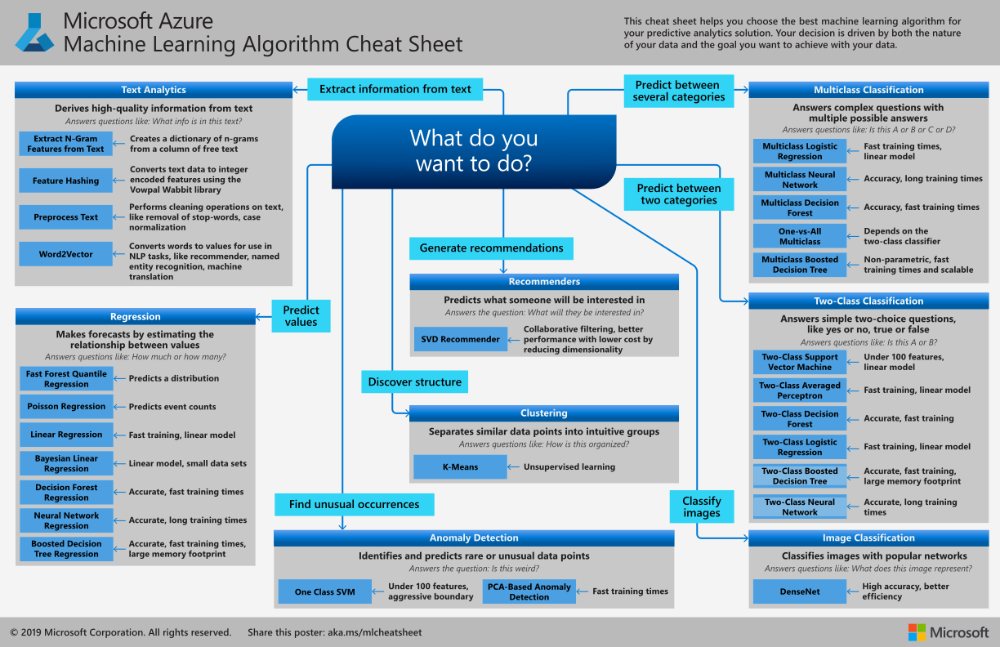
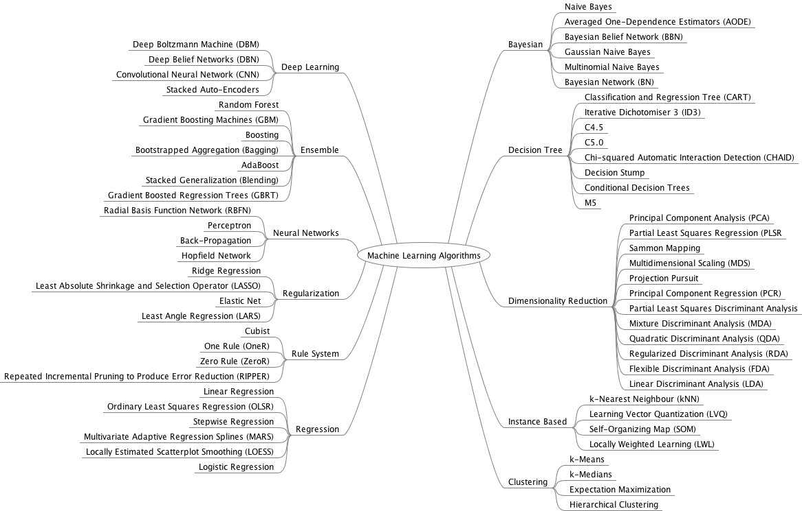
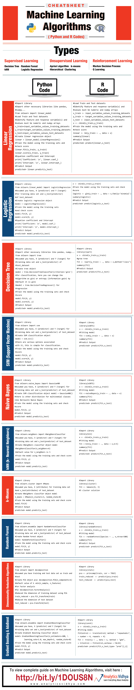

# Cheat Sheets

[Cheat Sheet of Machine Learning and Python (and Math) Cheat Sheets](https://medium.com/machine-learning-in-practice/cheat-sheet-of-machine-learning-and-python-and-math-cheat-sheets-a4afe4e791b6)

[Which machine learning algorithm should I use?](https://blogs.sas.com/content/subconsciousmusings/2017/04/12/machine-learning-algorithm-use/)

[Microsoft Azure Algorithm Flowchart](https://docs.microsoft.com/en-us/azure/machine-learning/algorithm-cheat-sheet)

## Algorithm Summary

[A Tour of Machine Learning Algorithms](https://machinelearningmastery.com/a-tour-of-machine-learning-algorithms/)

[Cheatsheet – Python & R codes for common Machine Learning Algorithms](https://www.analyticsvidhya.com/blog/2015/09/full-cheatsheet-machine-learning-algorithms/)

## Reference

[Cheat Sheet of Machine Learning and Python (and Math) Cheat Sheets](https://medium.com/machine-learning-in-practice/cheat-sheet-of-machine-learning-and-python-and-math-cheat-sheets-a4afe4e791b6)

[Which machine learning algorithm should I use?](https://blogs.sas.com/content/subconsciousmusings/2017/04/12/machine-learning-algorithm-use/)